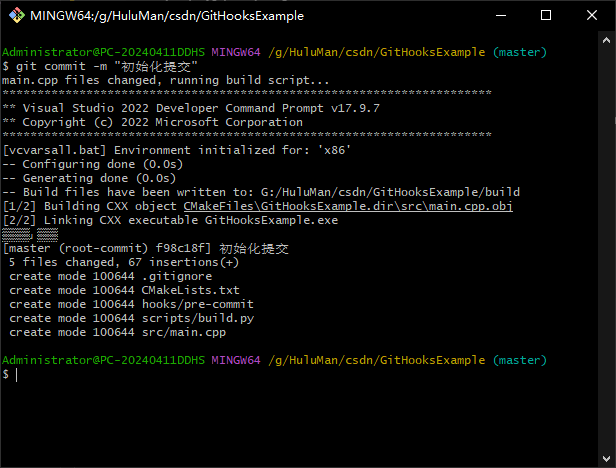
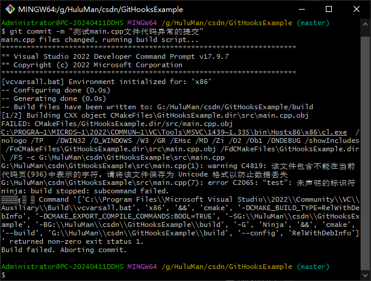

<div align="center">
  <h1>💾 Hook 钩子</h1>
</div>

___
@[TOC](目录)


# 🔔 简介
>Git Hooks是Git内置的一种机制，允许在特定事件发生时执行自定义脚本。Git Hook可以在客户端和服务器端配置，经常用于自动化任务、增强开发流程以及确保代码质量。

___

<br>

# 🔔 常见类型

<table>
	<tr>
		<th>📄项目</th>
		<th align=left>📜类型</th>
		<th>💡含义</th>
	</tr>
	<tr><td rowspan=7><b>客户端<br>Hooks</b></td></tr>
	<tr>
        <td align=left><i>pre-commit</td>
		<td>在提交前运行</td>
	</tr>
	<tr>
		<td align=left><i>prepare-commit-msg</td>
		<td>在生成提交信息前运行</td>
	</tr>
    <tr>
		<td align=left><i>commit-msg</td>
		<td>在提交信息编辑完成后运行</td>
	</tr>
    <tr>
		<td align=left><i>post-commit</td>
		<td>在提交完成后运行</td>
	</tr>
    <tr>
		<td align=left><i>pre-rebase</td>
		<td>在变基操作前运行</td>
	</tr>
    <tr>
		<td align=left><i>pre-push</td>
		<td>在推送代码前运行</td>
	</tr>
    <tr><td rowspan=4><b>服务器<br>Hooks</b></td></tr>
    <tr>
		<td align=left><i>pre-receive</td>
		<td>在服务器端接收到推送数据前运行</td>
	</tr>
    <tr>
		<td align=left><i>update</td>
		<td>在服务器端更新每个分支前运行</td>
	</tr>
    <tr>
		<td align=left><i>post-receive</td>
		<td>在服务器端接收推送数据后运行</td>
	</tr>
    
</table>

___

<br>

# 🔔 如何配置

**📄 个人配置：**
>将个人使用的Git Hook脚本存放在`.git/hooks`目录下。该目录默认包含一些示例脚本，可以将这些脚本重命名或替换为自定义脚本。

<br>

**📄 团队配置：**
>将所有团队成员需要的Hook脚本放在项目中的某个目录（例如`hooks`），然后在项目根目录的.git配置文件中配置`core.hooksPath`指向该目录。

配置命令：
    
```bash
git config core.hooksPath hooks
```
在`.git`目录下的`config`文件内容可看到多了`hooksPath = hooks` 的字段:
```sh
[core]
	...
	hooksPath = hooks
```

<br>

取消配置命令：
```bash
git config --unset core.hooksPath
```
___
<br>

# 🔔 使用场景

- 💡 代码格式检查：`pre-commit`在提交之前使用工具检查代码格式是否符合团队规范。
- 💡 运行单元测试：`pre-commit`在提交之前运行单元测试，确保新代码不会破坏现有功能。
- 💡 提交信息检查：`commit-msg`确保提交信息符合特定格式或包含必要的内容。
- 💡 代码审查：提交或推送代码时触发代码审查工具，自动化代码审查流程。
- 💡 自动部署：在推送代码到特定分支后结合CI/CD工具自动部署到测试或生产环境。

___
<br>

# 🔔 示例

以下是使用`pre-commit`作为钩子的示例。每次提交前会执行该钩子。

📄 **项目的结构：**
```
GitHooksExample
├─ CMakeLists.txt
├─ hooks
│    └─ pre-commit
├─ scripts
│    └─ build.py
└─ src
       └─ main.cpp
```

在hooks目录（使用`git config core.hooksPath hooks`命令配置指向该目录）下有一个`pre-commit`的钩子。
在scripts目录下有个Python脚本，该脚本会被钩子使用，执行的时候会构建项目。

<br>

📄 **`pre-commit`的内容：**
```sh
#!/bin/bash

# 如果src目录下存在修改的文件就运行Python脚本
changes_files=$(git diff --name-only --relative=src)
if [ -n "$changes_files" ] ;then
  echo "$changes_files" files changed, running build script...
  python  scripts/build.py
  if [ $? -ne 0 ]; then
      echo "Build failed. Aborting commit."
      exit 1
  fi
else
    echo "Skipping build: no changes in src directory."
fi

# 允许继续
exit 0
```

<BR>

📄 **`build.py`的内容：**
```python
import os
import sys
import subprocess

VCINSTALLDIR = "C:/Program Files/Microsoft Visual Studio/2022/Community/VC/Auxiliary/Build/vcvarsall.bat"

current_dir = os.path.dirname(os.path.dirname(os.path.abspath(__file__)))
build_dir = os.path.normpath(current_dir + "/build")
os.makedirs(build_dir, exist_ok=True)

build_cmd = [f'{os.path.normpath(VCINSTALLDIR)}', 'x86']

cmake_cmd = [
    f'cmake',
    f'-DCMAKE_BUILD_TYPE=RelWithDebInfo',
    f'-DCMAKE_EXPORT_COMPILE_COMMANDS:BOOL=TRUE',
    f'-S{current_dir}',
    f'-B{build_dir}',
    '-G', 'Ninja'
]
cmake_build_cmd = [
    f'cmake',   
    f'--build', f'{build_dir}', 
    f'--config', f'RelWithDebInfo'
]

cmd = build_cmd + ['&&'] + cmake_cmd + ['&&'] + cmake_build_cmd

try:
    subprocess.run(cmd, shell=True, check=True)
    print("编译成功！")
    sys.exit(0)
except subprocess.CalledProcessError as e:
    print("编译失败：", e)
    sys.exit(1)
```

<br>

📄 **提交时触发hooks：**



可以看到在提交前对工程进行构建编译，编译完成后才会提交。

<br>

📄 **提交异常代码时触发hooks：**

接下来演示一下当`main.cpp`文件代码异常时的提交：
```cpp
#include <iostream>

int main() {
    std::cout << "Hello, World!" << std::endl;
    
	//异常代码, 未定义 test
	test = 1;
	return 0;
}
```
进行提交时，可以看到编译构建失败，提交中止：



这样可以避免提交了一个错误的代码。减少错误。